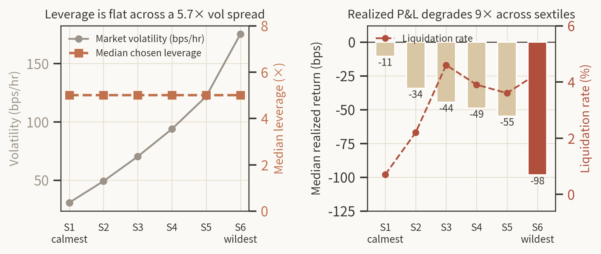
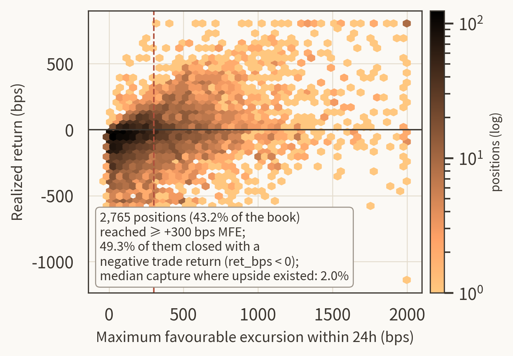
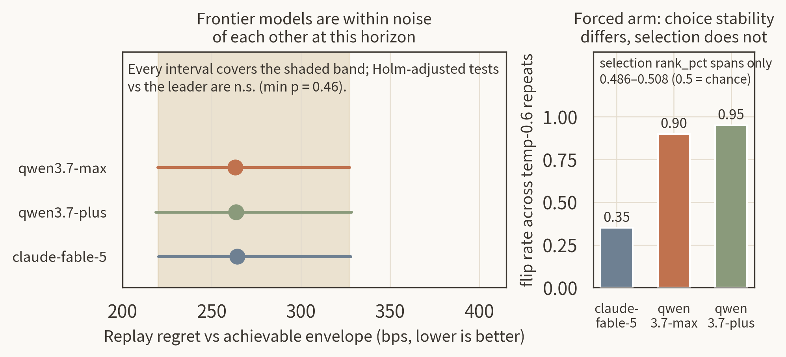

# A Continuous Record of Onchain LLM Trading Agents

**Operating-layer findings from two production systems: DX Terminal Pro (3,505 user-funded vaults, real ETH, 21 days) and the DXAP live alpha fleet (500–599 agents, Hyperliquid perps, 69 days, 231,638 recorded turns).**

**Links:** [Paper (arXiv, link at publication)](https://arxiv.org) · [Companion page (dxrg.ai)](https://www.dxrg.ai/blogs/operating-layer-controls-paper) · [Public datasets (dxrg.ai/research)](https://www.dxrg.ai/research) · [DX Terminal Pro paper (arXiv:2604.26091)](https://arxiv.org/abs/2604.26091)

DX Research Group (DXRG) · August 2026 · Contact: poof@dxrg.ai

---

## What this is

The measurement record of LLM trading agents operating under production conditions at population scale. One lab, two systems, six months, every turn logged. We report what the operating layer around the model does to behavior, what it cannot fix, and the methodology rules we now require after retracting two of our own claims.

## The record at a glance

| | DX Terminal Pro | DXAP live alpha |
|---|---|---|
| Window | Feb 26 – Mar 18, 2026 (21 days) | Jun 8 – Aug 15, 2026 (69 days) |
| Population | 3,505 user-funded vaults | 500–599 agents all-history; 91–117 concurrently active |
| Market | Base memecoin pools (real ETH) | Hyperliquid perpetuals (paper with live prices + small real-capital book) |
| Scale | 7.5M invocations, ~300K onchain actions, ~$20M volume, ~70B inference tokens | 231,638 multi-tool turns, 14,596 fills |
| Model | Qwen3-235B (SGLang) | Mostly qwen3.7-plus via OpenRouter |

## Headline findings

- **The operating layer determines behavior more than strategy text does.** A risk slider explains leverage (+0.425 per level); agent fixed effects absorb 60% of variance; a leaderboard rendered in the prompt causally routes 46.5% of trade entries (regression discontinuity 1.75× exactly at the render boundary).
- **Sizing is volatility-blind.** Median leverage is 5.0× in every volatility sextile across a 5.7× vol spread. One posture-plus-slider cell holds 11% of positions and 62% of liquidations (Mantel–Haenszel OR 22.37).
- **Agents capture almost none of the upside they reach.** 43.2% of positions touched ≥ +300 bps of favorable excursion within 24h; 49.3% of those closed with a negative trade return. A fixed 2%/4% bracket beat every discretionary exit we measured (+39.0 bps per position).
- **Neither fleet shows a directional edge.** No per-decision directional edge from any information source we tested, at context doses up to 770K tokens. The DXAP fleet is not profitable and trails a size-matched Hyperliquid retail benchmark.



*Median leverage by volatility sextile. Realized outcomes degrade 9× across the same spread.*



*Favorable excursion vs realized outcome across 6,400 closed positions.*



*Paired replay of 416 captured production scenarios: three frontier models within noise of each other on decision quality; choice repeatability differs (35% vs ~90–95% flip rates).*

## Data availability

The versioned public datasets behind this record live at [dxrg.ai/research](https://www.dxrg.ai/research) (JSON + CSV): the benchmark card, the guardrail matrix, mandate-compilation evidence, the state-and-memory checklist and evaluation fixtures, the execution-reconciliation matrix, the trace-feedback registry, the harness-transfer evaluation card, the benchmark audit registry, and the prompt-compilation ablation registry. Each dataset lists the articles that present it.

## Related work from the lab

- [Operating-Layer Controls for Onchain Language-Model Agents Under Real Capital](https://arxiv.org/abs/2604.26091) (arXiv:2604.26091) — the reliability-engineering record of DX Terminal Pro; this paper defers the trace-level behavioral analysis that the present paper delivers.

## Citation

```bibtex
@misc{barton2026continuous,
  title   = {A Continuous Record of Onchain LLM Trading Agents: Operating-Layer Findings from Two Production Systems},
  author  = {Barton, T.J. and Constantakis, Chris and Hauseman, Patti and Mous, Annie and Hoffman, Alaska and Bergeron, Brian and Goodreau, Hunter},
  year    = {2026},
  note    = {DX Research Group preprint},
  url     = {https://github.com/ProjectDXAI/continuous-record-llm-trading-agents}
}
```

## License

Paper text and figures: [CC BY 4.0](LICENSE). Dataset terms as listed with each dataset at dxrg.ai/research.
