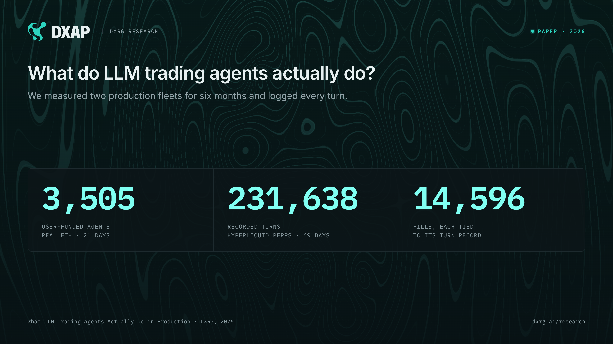
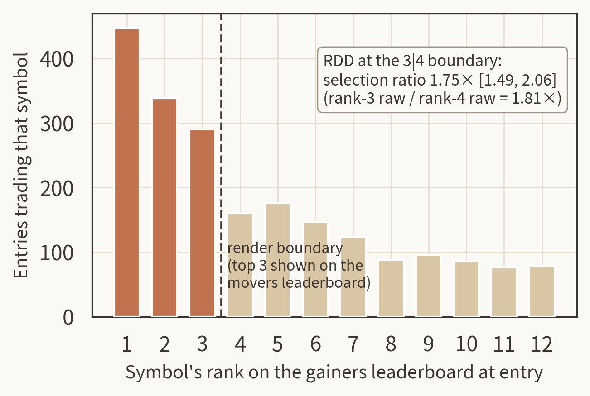

<p align="center">
  
</p>

# What LLM Trading Agents Actually Do in Production

### A Six-Month, Population-Scale Record from Two Fleets

[](https://arxiv.org) [](LICENSE) [](https://www.dxrg.ai/research) [](https://arxiv.org/abs/2604.26091)

**DX Research Group (DXRG) · September 2026 · [paper.pdf](paper.pdf) · contact poof@dxrg.ai**

Six months of LLM trading agents in production, every turn logged. DX Terminal Pro ran 3,505 user-funded vaults trading real ETH on Base for 21 days. The DXAP live alpha fleet ran 500 to 599 user-created agents on Hyperliquid perpetuals for 69 days: 231,638 recorded turns and 14,596 fills. This repo holds the paper, the figures, the aggregate data behind them, and the share cards.

## Four findings

1. **The operating layer decides behavior, more than anything written in strategy text.** A risk slider explains leverage (+0.425 per level), agent fixed effects absorb 60% of variance, and a nine-row leaderboard rendered in the prompt routes 46.5% of all trade entries. The regression discontinuity sits exactly on the render boundary: 1.75x [1.49, 2.06].
2. **Sizing is volatility-blind.** Median leverage is 5.0x in every volatility sextile across a 5.7x volatility spread. One posture-plus-slider cell holds 11% of positions and 62% of liquidations (Mantel-Haenszel OR 22.37). Telling the model its liquidation distance in text changed nothing.
3. **Agents reach the upside and keep almost none of it.** 43.2% of positions touched +300 bps of open profit within 24h; 49.3% of those still closed negative; median capture was 2.0%. A fixed 2%/4% bracket beat every discretionary exit we measured, +39.0 bps per position.
4. **Neither fleet shows a directional edge.** No per-decision edge from any information source, at context doses up to 770K tokens. The DXAP fleet is unprofitable and trails a size-matched Hyperliquid retail sample (41% vs 50% roundtrip win rate). Three frontier models tied on decision quality in a 416-scenario replay league; only their choice consistency differed (35% vs 90%+ flip rate).

The paper closes with a 17-rule methodology canon. Every rule was bought with a retraction or a failed claim inside this program; three of our own results were retracted along the way and appear only as retractions.

## The record at a glance

| | DX Terminal Pro | DXAP live alpha |
|---|---|---|
| Window | Feb 26 to Mar 18, 2026 (21 days) | Jun 8 to Aug 15, 2026 (69 days) |
| Population | 3,505 user-funded vaults | 500 to 599 agents all-history; 91 to 117 concurrently active |
| Market | Base memecoin pools, real ETH | Hyperliquid perpetuals, paper at live prices plus a small real-capital book |
| Scale | 7.5M invocations, ~300K onchain actions, ~$20M volume | 231,638 multi-tool turns, 14,596 fills |
| Model | Qwen3-235B via SGLang, one frozen runtime | Mostly qwen3.7-plus via OpenRouter |

## Figures

<p align="center"></p>

*Fig. 4. Median chosen leverage sits at 5.0x in every volatility sextile. Median realized return falls from -10.6 to -98.2 bps across the same spread.*

<p align="center"></p>

*Fig. 6. Maximum favorable excursion within 24h against realized return for 6,400 closed positions.*

<p align="center"></p>

*Fig. 3. Entries by gainers-leaderboard rank at entry. Ranks 1 to 3 are rendered in the prompt.*

<p align="center"></p>

*Fig. 8. Paired replay of 416 captured production scenarios. Regret intervals overlap for all three models; flip rate across identical repeats does not.*

All eight figures are in [`figures/`](figures/) as 300-dpi PNG; the paper uses the vector versions.

## Data

[`data/`](data/) holds the aggregate extracts behind Figures 1, 2, 3, 5, and 8, the same files shipped as arXiv ancillary files. [`data/README.md`](data/README.md) maps each file to its figure. No per-user or per-position rows are published.

The versioned public datasets behind DXRG's published work live at [dxrg.ai/research](https://www.dxrg.ai/research): the benchmark card, the guardrail matrix, mandate-compilation evidence, the state-and-memory checklist and evaluation fixtures, the execution-reconciliation matrix, the trace-feedback registry, the harness-transfer evaluation card, the benchmark audit registry, and the prompt-compilation ablation registry.

## Share cards

[`cards/`](cards/) holds five 1600x900 cards (rendered at 2x) covering the scale of the record, the model league, the capture gap, volatility-blind sizing, and the render boundary. Same license as the paper; use them freely with attribution.

## Related work from the lab

- [Operating-Layer Controls for Onchain Language-Model Agents Under Real Capital](https://arxiv.org/abs/2604.26091) (arXiv:2604.26091): the reliability-engineering record of DX Terminal Pro. It deferred the trace-level behavioral analysis that this paper delivers.
- Companion page on dxrg.ai: live at announcement.

## Citation

```bibtex
@misc{barton2026production,
  title   = {What LLM Trading Agents Actually Do in Production: A Six-Month, Population-Scale Record from Two Fleets},
  author  = {Barton, T.J. and Constantakis, Chris and Hauseman, Patti and Mous, Annie and Hoffman, Alaska and Bergeron, Brian and Goodreau, Hunter},
  year    = {2026},
  note    = {DX Research Group preprint; arXiv identifier added at announcement},
  url     = {https://github.com/ProjectDXAI/continuous-record-llm-trading-agents}
}
```

## License

Paper text, figures, and cards: [CC BY 4.0](LICENSE). Dataset terms as listed with each dataset at dxrg.ai/research.
